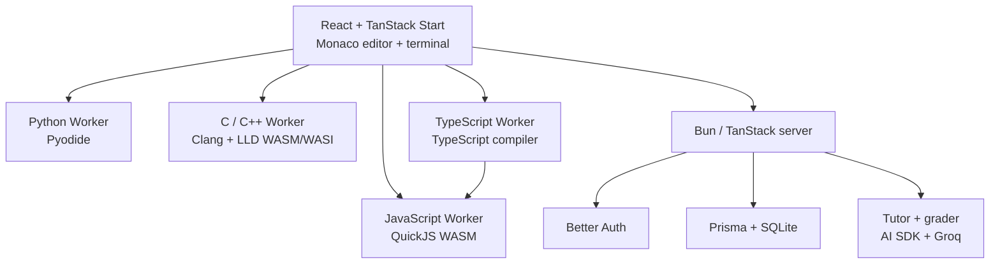

# Emipy

> A browser-native programming learning environment for Python, C, C++, JavaScript and TypeScript.

[](https://github.com/andreadicoste/emipy/actions/workflows/check.yml)
[](LICENSE)

Emipy combines a Monaco-based code workspace, interactive terminal, structured courses, persistent progress and AI-assisted tutoring in a single self-hostable application.

The unusual part is the runtime model: **student code is compiled or interpreted in the browser**, inside dedicated Web Workers, instead of being sent to a remote code-execution service. Python runs through Pyodide, C and C++ through Clang/LLD compiled to WebAssembly, JavaScript through QuickJS WASM, and TypeScript is type-checked and compiled in-browser before running in QuickJS.

The server is responsible for authentication, persistence, curriculum state and AI orchestration — not arbitrary student code execution.

## Highlights

The public home page includes a small, on-demand JavaScript playground. It uses
Monaco and the existing QuickJS Worker without authentication, database writes,
AI calls, or loading the other language runtimes. Code lives only in the current
tab. Demo executions have a 10-second watchdog (paused while awaiting input) and
a 64 KiB output limit; STOP terminates the Worker.

The playground requires HTTPS or localhost and the same COOP/COEP headers as the
full application. It is currently served by the application, not a separate
static-only deployment. Browser execution reduces server computation, but does
not protect the origin or a home connection from DDoS traffic; protection must
be provided by the hosting/network layer.

- **Five languages:** Python, C11, C++17, JavaScript and TypeScript.
- **Browser-native execution:** isolated Web Workers and WebAssembly runtimes.
- **Real editor experience:** Monaco, multi-file projects and a terminal with interactive stdin.
- **Structured learning:** courses, lessons, exercises, unlock progression and saved progress.
- **AI tutor:** lesson-aware assistance that can inspect real execution results without editing the student's code.
- **Semantic grader:** generates runtime test plans and evaluates whether a solution satisfies the exercise concept rather than matching one exact implementation.
- **Persistent workspaces:** programs and exercise submissions are stored server-side while execution remains client-side.
- **Admin tools:** user management and curriculum editing.
- **Self-hostable:** Bun, SQLite, Docker and a small operational footprint.

## Architecture



Each execution starts in a fresh runtime context. Stopping a program terminates its Worker, including while it is compiling, waiting for input or stuck in a loop.

## Language runtimes

| Language | Runtime | Main capabilities | Important limits |
| --- | --- | --- | --- |
| Python | Pyodide in a Worker | Python console programs, local modules, interactive input | No arbitrary native packages; browser/Pyodide constraints apply |
| C | Clang/LLD 8.0.1 + WASI | C11, multiple source/header files, stdio, temporary files | No processes, network, threads or native package installation |
| C++ | Same Clang/LLD toolchain + libc++ | C++17, STL, templates, smart pointers, mixed C/C++ projects | Exceptions are disabled; no processes/network/threads |
| JavaScript | QuickJS 0.32.0 WASM | ES modules, promises, async/await, top-level await, console/input | No DOM, Node.js, npm, network, timers or remote imports |
| TypeScript | TypeScript compiler + QuickJS | Strict checking, ES2022, local TS modules, generics, interfaces, enums | No DOM, Node.js, npm, JSX/TSX, custom tsconfig or remote imports |

### C and C++ toolchain

The C/C++ runtime is pinned to revision `648c4a89997a351eef75cdaec3ef5b89d4937dec` of [binji/wasm-clang](https://github.com/binji/wasm-clang). Runtime assets are verified with SHA-256 during preparation and are not stored in the Git history.

The first development build downloads roughly 58 MiB of compiler/runtime assets. Validated assets are then cached under `public/c-runtime/<revision>/`.

The vendored WASI shim retains its upstream Apache-2.0 and LLVM license files in `src/lib/c-runtime/vendor/`.

### Execution limits

The runtime intentionally places hard boundaries around student programs:

- C/C++ compilation/linking: 60 seconds.
- Interactive execution: 30 seconds, excluding time waiting for user input.
- Exercise evaluation execution: 10 seconds.
- Program memory: 64 MiB for compiled C/C++ programs.
- QuickJS heap: 64 MiB.
- Runtime stack: 1 MiB where applicable.
- Output: 1 MiB.
- Up to 24 additional project files.

These limits are part of the product model, not a substitute for operating-system sandboxing. Emipy's browser runtimes are intended for educational console programs.

## TypeScript execution pipeline

TypeScript uses a separate Worker so the compiler does not inflate the normal JavaScript runtime.

```text
main.ts + local modules
        ↓
TypeScript strict type-check
        ↓
ES2022 JavaScript
        ↓
QuickJS WASM
        ↓
stdout / stderr / input
```

Compile failures are reported separately from runtime failures, including the original TypeScript file, line, column and diagnostic code.

## AI tutor and grader

Emipy has two distinct AI flows.

### Tutor

The tutor receives the trusted lesson/exercise specification, the current workspace snapshot and the latest execution result. It is intentionally read-only: it cannot mutate code, progress or database state.

Student code, comments, stdout, stderr and messages are treated as **untrusted data**, not instructions. When useful, the tutor can request a real execution of the current program with chosen stdin rather than inventing output.

### Grader

The grader evaluates exercises in two stages:

1. It creates a small runtime test plan from the trusted exercise specification.
2. Emipy runs those cases in isolated Workers and sends the results back for semantic evaluation.

The grader is instructed to accept alternative and creative solutions when they satisfy the actual learning objective. It does not require the student's algorithm, variable names or output wording to match a reference implementation unless the exercise explicitly requires them.

## Curriculum

Curriculum content lives in version-controlled JSON files under `content/`; user progress lives in SQLite.

The published catalog currently contains **21 courses** across Python, C, C++, JavaScript and TypeScript. Courses unlock independently within each language, so starting C does not require completing Python.

Every course declares its language, lessons refer to courses by ID, and exercises must match the language of their parent course. Curriculum validation runs in CI.

TinaCMS can be used as an editing interface for curriculum content.

## Stack

| Area | Technology |
| --- | --- |
| Runtime | Bun |
| Full-stack framework | TanStack Start + React + Vite |
| Routing | TanStack Router |
| Styling | Tailwind CSS + Radix UI |
| Editor | Monaco Editor |
| Python runtime | Pyodide |
| C/C++ runtime | Clang/LLD WASM + WASI |
| JavaScript runtime | QuickJS WASM |
| TypeScript runtime | TypeScript compiler + QuickJS |
| Authentication | Better Auth |
| ORM | Prisma 7 |
| Database | SQLite |
| AI | Vercel AI SDK + Groq provider |
| Curriculum CMS | TinaCMS |
| Testing | Bun Test + Playwright |
| Deployment | Docker |

## Getting started

### Requirements

- Bun 1.4.2+
- A modern browser with WebAssembly and `SharedArrayBuffer` support
- Network access on the first C/C++ runtime preparation

### Install

```sh
git clone https://github.com/andreadicoste/emipy.git
cd emipy

bun install --frozen-lockfile
cp .env.example .env

mkdir -p data
touch data/emipy.db

bun run db:generate
bun run db:deploy
bun run dev
```

The app is available at `http://localhost:3000`.

C/C++ assets are prepared automatically by `dev` and `build`. To prepare them explicitly:

```sh
bun run runtime:prepare
```

### Environment

At minimum configure:

| Variable | Purpose |
| --- | --- |
| `DATABASE_URL` | Prisma SQLite URL, for example `file:./data/emipy.db` |
| `BETTER_AUTH_SECRET` | Random authentication secret, at least 32 characters |
| `BETTER_AUTH_URL` | Public/base URL used by Better Auth |
| `APP_ORIGIN` | Trusted application origin |
| `GROQ_API_KEY` | Required for tutor and grader features |
| `AI_MODEL` | Optional Groq model override |

Never commit a real `.env` file.

### Create the first administrator

Public signup is disabled by default. Create an administrator interactively:

```sh
bun run admin:create
```

The script asks for name, email and password in the terminal and does not accept a password through command-line arguments or environment variables.

## Development commands

```sh
# Development server
bun run dev

# TypeScript
bun run typecheck

# Validate curriculum
bun run content:validate

# Production build
bun run build

# Unit/integration tests
bun test

# Browser tests
bunx playwright install chromium
bunx playwright test
```

Some end-to-end tests require a running local server and test credentials. They modify the configured database, so use a dedicated test database.

## Docker

Build the image:

```sh
docker build -t emipy .
```

Run it with a persistent data directory and runtime secrets:

```sh
docker run --rm \
  -p 3000:3000 \
  -v "$(pwd)/data:/app/data" \
  -e DATABASE_URL=file:/app/data/emipy.db \
  -e BETTER_AUTH_SECRET="replace-with-a-long-random-secret" \
  -e BETTER_AUTH_URL=http://localhost:3000 \
  -e APP_ORIGIN=http://localhost:3000 \
  -e GROQ_API_KEY="your-key" \
  emipy
```

The container creates the SQLite file when necessary and applies Prisma migrations at startup. A health endpoint is exposed at `/api/health`.

For SQLite backups, stop writes first or use SQLite's `VACUUM INTO`; do not blindly copy only the main database file while a WAL is active.

## Project layout

```text
content/                  version-controlled courses, lessons and exercises
prisma/                   schema and migrations
scripts/                  runtime preparation, curriculum validation, admin tooling
src/components/           application UI
src/lib/                  auth, persistence, curriculum and runtime helpers
src/lib/c-runtime/        C/C++ compiler integration and vendored WASI shim
src/lib/javascript-runtime/
src/lib/typescript-runtime/
src/routes/               TanStack routes and server endpoints
src/workers/              isolated language/evaluation Workers
tests/                    Playwright end-to-end tests
server.ts                 native Bun production server
```

## Production server

Production is served directly by Bun through `server.ts`. Static files come from `dist/client`; dynamic requests are passed to the built TanStack Start handler.

The server applies COOP/COEP/CORP headers required by `SharedArrayBuffer` and caches revisioned C/C++ runtime assets immutably.

## Security notes

- Student programs execute in browser Workers rather than on the application server.
- Authentication is handled by Better Auth with public signup disabled by default.
- Server-side program access is scoped to the authenticated user.
- AI prompts explicitly separate trusted curriculum instructions from untrusted student-controlled content.
- Secrets belong in environment variables and are excluded from Git.
- The project still has the security characteristics of a young application under active development; review it before exposing a self-hosted instance to untrusted users.

See [SECURITY.md](SECURITY.md) for vulnerability reporting.

## Contributing

Contributions are welcome. Please read [CONTRIBUTING.md](CONTRIBUTING.md) before opening a pull request.

The most useful areas include runtime correctness, browser compatibility, curriculum quality, tests, accessibility and documentation.

## License

Emipy is licensed under the [Apache License 2.0](LICENSE).

Third-party components keep their respective licenses; vendored C-runtime notices are preserved alongside the relevant files.
